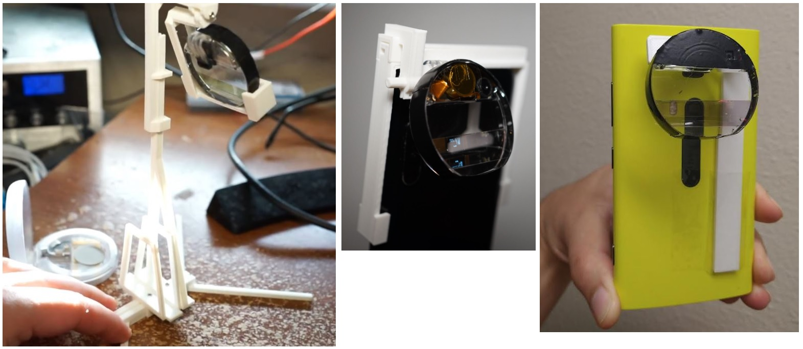

### About

This is a web-based video stream **using your phone**.

In this case the easiest way (without undrestanding WebRTC) to get this to work is to use a paid for service.

This is used with [some device](https://github.com/jdc-cunningham/bl-monocle-stuff) to make the monocle visible to a phone camera see below:

### This is not free / requires HTTPS (between two devices)

While it does not cost much to run (partial cents per min) it is not free.

For the two devices you could see about an ngrok tunnel or self signed certs but I used an actual VPS/let's encrypt

### Modes

There are two modes to this app:

* phone
* editor

Defined by setting a `#phone` in the url to indicate it's the phone.

That styles the page eg. a phone only transmits video and won't show the editor/designed for portrait.

### Resources

The video bit

https://developer.vonage.com/en/blog/opentok-react-components-dr
